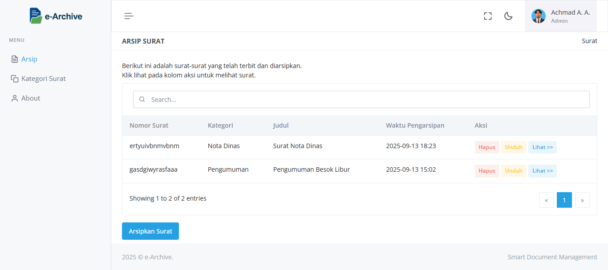
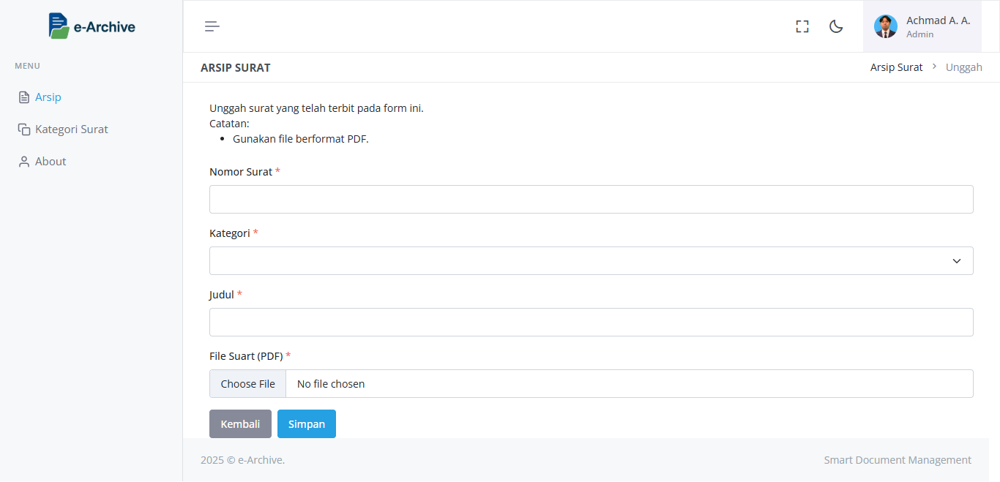

# **JUDUL**  
SISTEM MENYIMPANAN / ARSIP SURAT  

---

# **TUJUAN**  
- Menyediakan sistem pengarsipan digital  
- Mempermudah proses pencarian surat  
- Mendukung kemudahan distribusi dan akses dokumen
- Mengurangi resiko kerusakan atau kehilangan dokumen   

---

# **FITUR**  
- **ARSIP SURAT**  
  Pada fitur ini menampilkan data dokumen-dokumen yang sudah di tambahkan. Selain itu, juga dapat menyimpan, mengedit, melihat dokumen, dan menghapus dokumen.  

- **MANAJEMEN KATEGORI SURAT**  
  Pada fitur ini menampilkan data kategori-kategori dari dokumen. selain itu, juga dapat menyimpan, mengedit, dan menghapus data kategori dikumen.  

- **PENCARIAN SURAT**  
  Fitur yang digunakan untuk mencari data surat berdasarkan judul surat.  

---

# **CARA MENJALANKAN APLIKASI**

### <u>**KEBUTUHAN SISTEM**</u>
Pastikan sudah menginstall:
- Node.js v18
- Angular v15

### <u>**FRONTEND**</u>  
1. Masuk ke folder `e-archive`  
2. Install dependency:  
   ```bash
   npm install
3. run project:  
   ```bash
   npm run dev
### <u>**BACKEND/API**</u> 
1. Masuk ke foler `e-archive-api`
2. Install dependency:
    ```bash
    npm install
3. buat file baru .env.dev atau env.prod berdasarkan env.example
4. run project:  
   ```bash
   npm run dev

# **TAMPILAN SISTEM**
### <u>**HALAMAN ARSIP SURAT**</u>   

### <u>**HALAMAN UNGGAH SURAT**</u>   

### <u>**HALAMAN LIHAT SURAT**</u>   

### <u>**ALERT HAPUS SURAT**</u>   

### <u>**HALAMAN KATEGORI SURAT**</u>   

### <u>**HALAMAN TAMBAH KATEGORI SURAT**</u>   

### <u>**HALAMAN EDIT KATEGORI SURAT**</u>   

